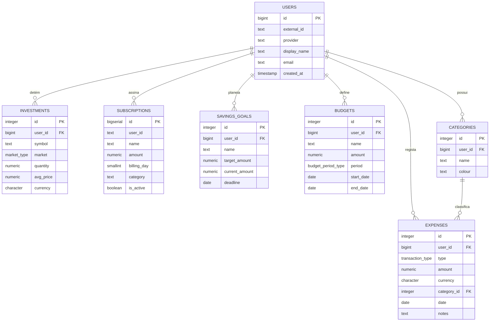

# 📂 Especificações Técnicas: BD & APIs

Este documento contém os detalhes técnicos "sob o capô" exigidos pelos pontos 01, 02 e 03 da apresentação.

---

## 📊 Modelo Entidade-Relação (ER) Completo

---

## 📗 Dicionário de Dados Detalhado

| Tabela | Campo | Tipo | Restrição | Descrição |
| :--- | :--- | :--- | :--- | :--- |
| `users` | `id` | `BIGINT` | `PK, IDENTITY` | Identificador interno. |
| `users` | `external_id` | `TEXT` | `NOT NULL` | ID do provedor (Google). |
| `subscriptions` | `user_id` | `TEXT` | `NOT NULL` | Mapeamento manual de utilizador. |
| `expenses` | `type` | `ENUM` | `transaction_type` | Tipo de movimento. |
| `expenses` | `amount` | `NUMERIC` | `> 0` | Valor da despesa/receita. |
| `savings_goals` | `target_amount` | `NUMERIC` | `> 0` | Meta de poupança. |
| `investments` | `market` | `ENUM` | `market_type` | Cripto ou Ações. |
| `budgets` | `period` | `ENUM` | `budget_period_type` | Mensal ou Anual. |
| `categories` | `user_id` | `BIGINT` | `FK, CASCADE` | Dono da categoria. |

---

## 🌐 Integração de APIs Externas

### 1. CoinGecko (Mercado Crypto)
*   **Endpoint:** `https://api.coingecko.com/api/v3/simple/price`
*   **Dados:** Preço em tempo real de BTC, ETH, SOL em EUR.
*   **Integração:** Microserviço `investments` (Python).

### 2. Google Gemini (IA Sensei)
*   **Modelo:** `gemini-2.0-flash-lite`
*   **Dados:** Contexto de gastos do utilizador enviado via JSON.
*   **Integração:** Microserviço `finance` (Python).

### 3. ExchangeRate-API (Câmbios)
*   **Endpoint:** `https://open.er-api.com/v6/latest/EUR`
*   **Dados:** Taxas de câmbio mundiais atualizadas.
*   **Integração:** Frontend React (Javascript).

---

## 🔐 Autenticação (JWT Flow)
1.  **Login:** Utilizador autentica via Google.
2.  **Token:** O sistema gera um **JWT** que contém o `external_id`.
3.  **Autorização:** O Frontend envia o token no Header `Authorization`.
4.  **Validação:** O Backend extrai o `user_id` do token para filtrar os dados da BD.
